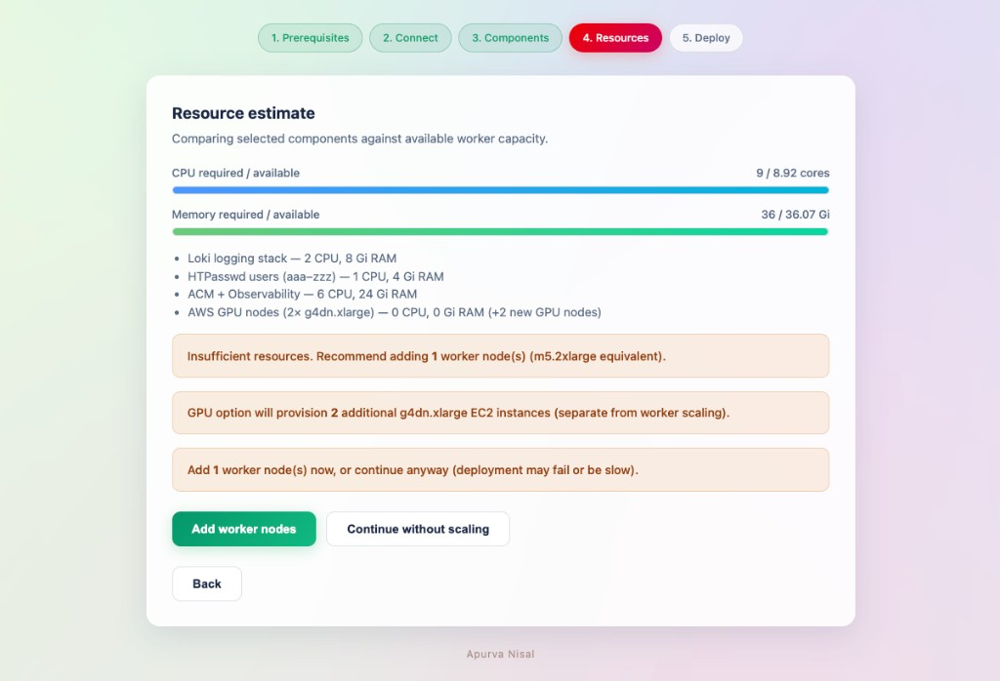
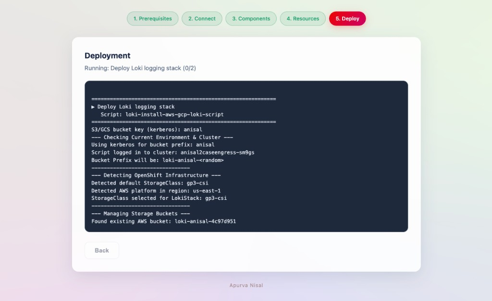

# OCP Reproducer Toolkit

A local web wizard that tops up an **existing OpenShift cluster** on AWS or GCP with common demo components — Loki logging, HTPasswd users, ACM + Observability, and AWS GPU nodes — in a few clicks.

**Pick. ✓ Sit back. ☕ We've got this. 😎**

Runs on your Mac or Linux machine. Scripts execute locally using your `oc`, `aws`, and cloud credentials — nothing runs inside the cluster UI itself.

---

## What it does

| Component | What gets installed |
|-----------|---------------------|
| **Loki logging** | Loki Operator, Cluster Logging, Cluster Observability Operator, LokiStack with S3/GCS storage, log forwarding, Logging UI plugin |
| **HTPasswd users** | OAuth HTPasswd provider, `redadmin` (cluster-admin), users `aaa` → `zzz` (password = username) |
| **ACM + Observability** | Advanced Cluster Management, MultiClusterHub, Thanos object storage on S3/GCS, MultiClusterObservability |
| **GPU nodes** (AWS only) | 2× `g4dn.xlarge` workers, NVIDIA GPU Operator, DCGM dashboard, CUDA test pod |

The wizard also:

- Scans local prerequisites (`oc`, `aws`, `jq`, `htpasswd`, etc.)
- Estimates CPU/RAM against worker capacity and can scale workers before deploy
- Streams live deployment logs in the browser
- Reuses empty S3/GCS buckets from the last ~1.5 days when possible

> **Phase 1 (current):** Top up an existing cluster.  
> **Phase 2 (planned):** Deploy a brand-new AWS OpenShift cluster from scratch.

---

## Quick start

```bash
git clone https://github.com/apunisal/openshift-reproducer-toolkit.git
cd openshift-reproducer-toolkit

./install.sh    # Python venv + dependencies
./start.sh      # Opens http://127.0.0.1:8765
```

Stop the server:

```bash
./stop.sh
# or type `stop` in the terminal where start.sh is running
```

### Prerequisites (on your laptop)

| Tool | Required | Notes |
|------|----------|-------|
| Python 3.9+ | Yes | Used by the wizard backend |
| `oc` CLI | Yes | Logged into target cluster |
| AWS CLI + credentials | For AWS | `~/.aws/credentials` |
| GCP credentials | For GCP | Key files under `~/.gcp/` |
| `jq`, `htpasswd`, `openssl` | Yes | Used by install scripts |
| `gcloud` | Optional | Needed for some GCP operations |

---

## Wizard walkthrough

The UI is a 5-step wizard. Screenshots below follow the same order you use in the tool.

### Step 1 — Prerequisites

Overview of installable components plus an automatic scan of tools on your machine.


---

### Step 2 — Connect

Enter cluster credentials. **Kerberos** is a short name used **only** for S3/GCS bucket naming — it is separate from your OpenShift login username.

| Field | Purpose |
|-------|---------|
| **Kerberos** | Bucket key, e.g. `sunny` → `loki-sunny-<random>`, `acm-sunny-<random>` |
| **Username** | OpenShift login user (`kubeadmin`, `aaa`, etc.) |
| **Password** | Cluster password |
| **Kubernetes API URL** | API endpoint, e.g. `https://api.cluster.example.com:6443` |


After a successful login, the wizard shows cluster platform, region, worker count, and allocatable CPU/RAM.


---

### Step 3 — Components

Select what to deploy. Each card lists exactly what the underlying shell script will do.


**Execution order:** Loki → Users (with Loki alerting variant if Loki is selected) → ACM → GPU

---

### Step 4 — Resources

Compares selected components against available worker capacity. If resources are tight, you can add worker nodes or continue anyway.



---

### Step 5 — Deploy

Live streamed logs from each script. Errors surface in a dedicated panel above the log window.



---

## Project layout

```
├── app/
│   ├── main.py              # FastAPI backend
│   ├── static/              # Wizard UI (HTML/CSS/JS)
│   └── services/            # Login, prereqs, resources, script runner
├── scripts/                 # Shell scripts run against the cluster
│   ├── loki-install-aws-gcp-loki-script
│   ├── setup-users+redadmin.sh
│   ├── setup_users+loki_alerting.sh
│   ├── acm_acmobserve_aws_gcp.sh
│   └── provision-gpu-and-metrics.sh
├── docs/images/             # README screenshots
├── install.sh               # One-time setup
├── start.sh                 # Start wizard (port 8765)
└── stop.sh                  # Stop wizard
```

Scripts run on your machine with `cwd` set to the project root. The runner passes `OCP_TOOLKIT_KERBEROS` and `OCP_TOOLKIT_AUTO_YES=1` into the environment.

---

## Kerberos & bucket naming

Kerberos is **not** your OpenShift username. It is a stable short identifier so buckets are predictable and reusable across runs.

| Component | Bucket pattern |
|-----------|----------------|
| Loki | `loki-<kerberos>-<random>` |
| ACM / Thanos | `acm-<kerberos>-<random>` |

Example: Kerberos = `sunny`, username = `kubeadmin` → buckets like `loki-sunny-48291` and `acm-sunny-48291`.

---

## Requirements

- An **existing** OpenShift 4.x cluster (AWS or GCP)
- Cluster-admin or sufficient privileges for operators, OAuth, MachineSets
- Local cloud credentials matching the cluster platform

---

## Author

**Apurva Nisal**

---

## License

See repository license file (if present) or contact the maintainer.
