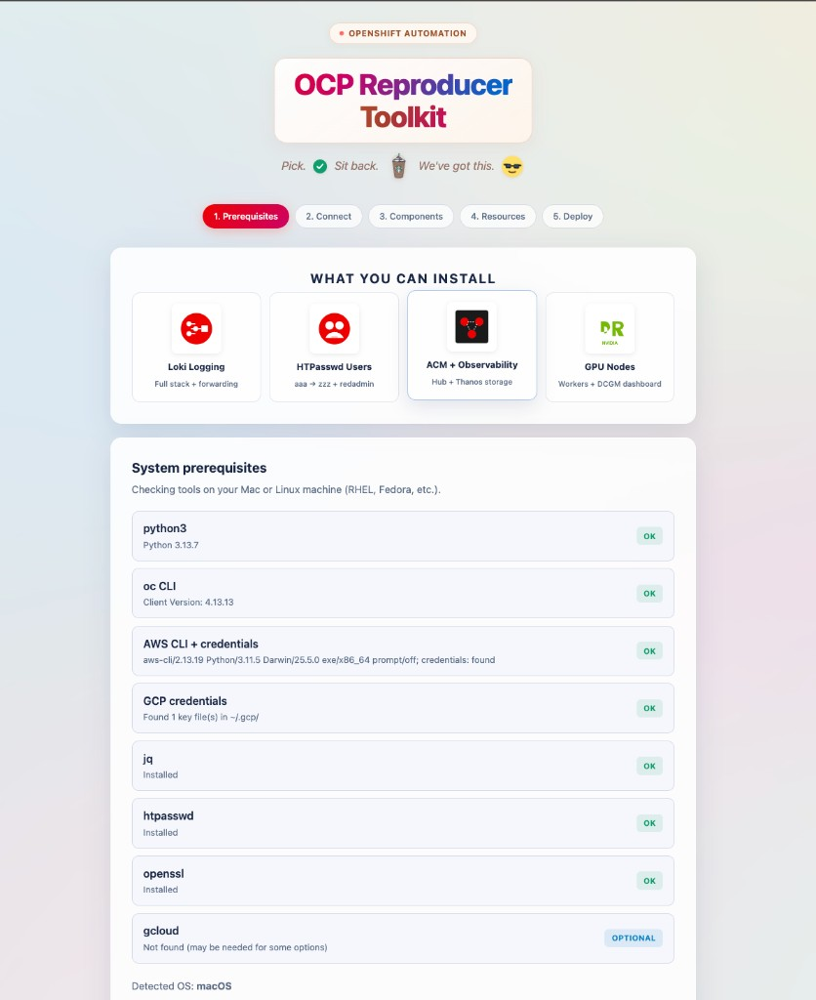
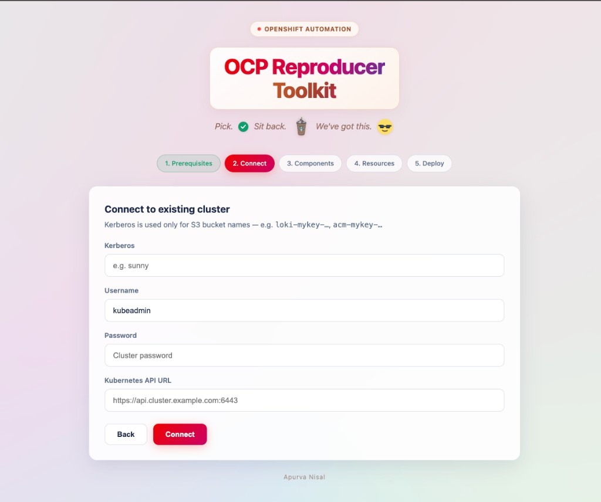
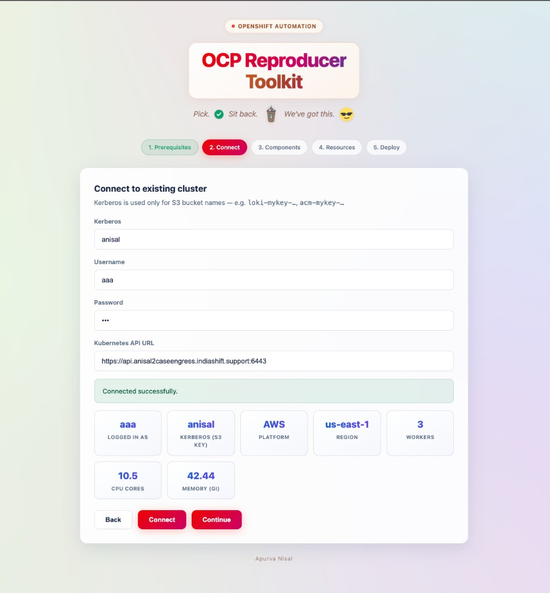
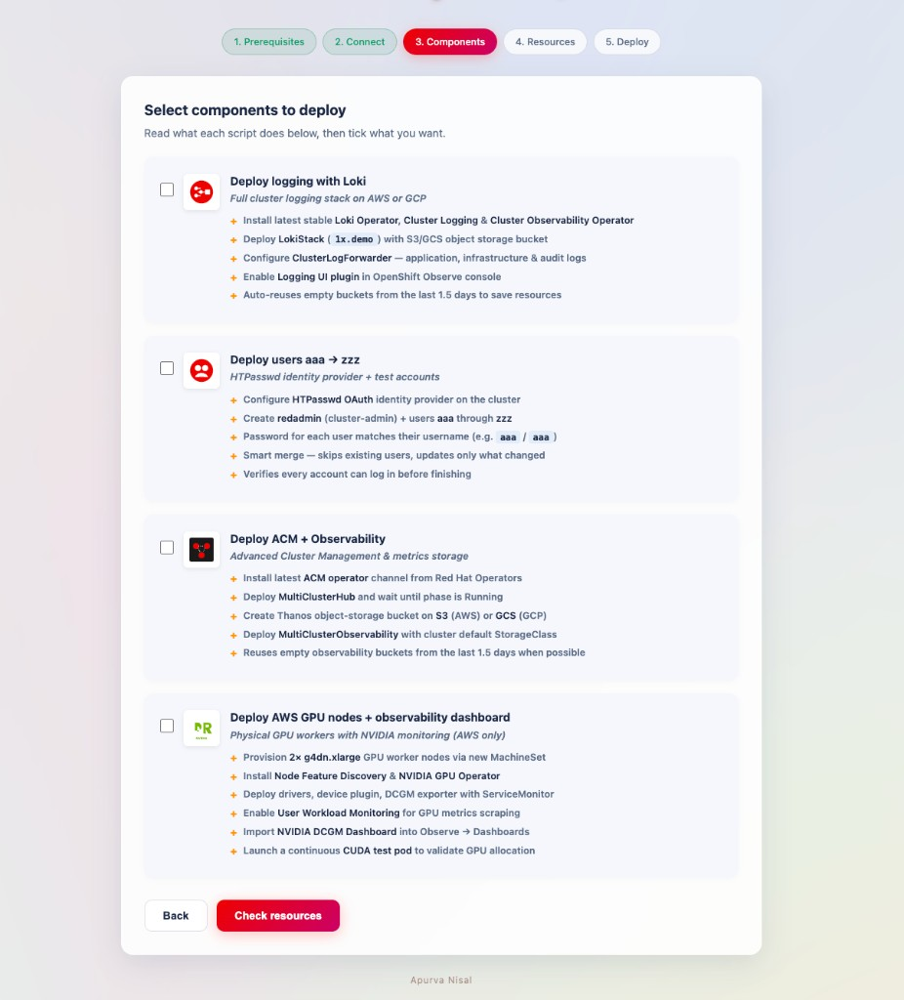

# OpenShift Reproducer Toolkit

Shell scripts to top up an **existing OpenShift cluster** on AWS or GCP — plus a local web wizard to run them in a few clicks.

**Pick. ✓ Sit back. ☕ We've got this. 😎**

---

## Repository layout

| Path | Description |
|------|-------------|
| **Root `*.sh` scripts** | Standalone install scripts (run directly or via the wizard) |
| **[`application/`](application/)** | Web wizard UI + FastAPI backend |

### Install scripts (repo root)

- `loki-install-aws-gcp-loki-script` — Loki logging stack
- `setup-users+redadmin.sh` — HTPasswd users `aaa`–`zzz` + `redadmin`
- `setup_users+loki_alerting.sh` — Users + Loki alerting demo
- `acm_acmobserve_aws_gcp.sh` — ACM + Observability
- `provision-gpu-and-metrics.sh` — AWS GPU nodes + DCGM dashboard

---

## Quick start

```bash
git clone https://github.com/apunisal/openshift-reproducer-toolkit.git
cd openshift-reproducer-toolkit/application

./install.sh    # Python venv + dependencies
./start.sh      # Opens http://127.0.0.1:8765
```

Stop the server: `./stop.sh` or type `stop` in the terminal where `start.sh` is running.

### Prerequisites (on your laptop)

| Tool | Required | Notes |
|------|----------|-------|
| Python 3.9+ | Yes | Wizard backend |
| `oc` CLI | Yes | Target cluster access |
| AWS CLI + credentials | For AWS | `~/.aws/credentials` |
| GCP credentials | For GCP | Key files under `~/.gcp/` |
| `jq`, `htpasswd`, `openssl` | Yes | Used by scripts |
| `gcloud` | Optional | Some GCP operations |

---

## Wizard walkthrough

5-step wizard. Screenshots in the order you use the tool.

### Step 1 — Prerequisites

Component overview + automatic scan of tools on your machine.



---

### Step 2 — Connect

**Kerberos** is used **only** for S3/GCS bucket names — separate from your OpenShift login username.

| Field | Purpose |
|-------|---------|
| **Kerberos** | Bucket key, e.g. `sunny` → `loki-sunny-<random>`, `acm-sunny-<random>` |
| **Username** | OpenShift login (`kubeadmin`, `aaa`, etc.) |
| **Password** | Cluster password |
| **Kubernetes API URL** | e.g. `https://api.cluster.example.com:6443` |



After login — platform, region, workers, CPU/RAM:



---

### Step 3 — Components

Select what to deploy. Each card describes what the script does.



**Order:** Loki → Users → ACM → GPU

---

### Step 4 — Resources

CPU/RAM estimate vs worker capacity. Option to scale workers before deploy.


---

### Step 5 — Deploy

Live streamed logs from each script.


---

## Kerberos & bucket naming

| Component | Bucket pattern |
|-----------|----------------|
| Loki | `loki-<kerberos>-<random>` |
| ACM / Thanos | `acm-<kerberos>-<random>` |

Example: Kerberos = `sunny` → `loki-sunny-48291`, `acm-sunny-48291`

---

## Author

**Apurva Nisal**
